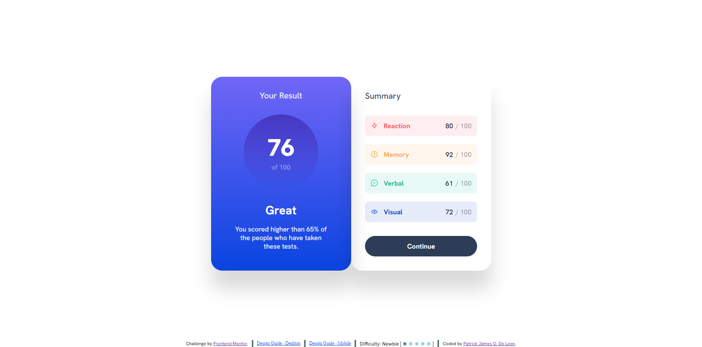

# Frontend Mentor - QR code component solution

This is a solution to the [Result Summary component challenge on Frontend Mentor](https://www.frontendmentor.io/challenges/results-summary-component-CE_K6s0maV). Frontend Mentor challenges help you improve your coding skills by building realistic projects.

## Table of contents

- [Overview](#overview)
  - [Screenshot](#screenshot)
  - [Links](#links)
- [My process](#my-process)
  - [Built with](#built-with)
  - [What I learned](#what-i-learned)
- [Author](#author)

## Overview

### Screenshot

### Links

- Solution URL: [Github](https://github.com/EcePJD/frontendMentor_resultSummaryComponent)
- Live Site URL: [Github.io](https://ecepjd.github.io/frontendMentor_resultSummaryComponent/)

## My process
The first thing I did is create an asynchronous javascript function that will wait until fetching of the json data is done before continuing the process. The next function I did was a function that combines the dom createElement function and the setAttributes function to create the elements with attributes from the json data. I used a document fragment as a temporary holder of all the appended newly created elements then after the process is done, append the fragment variable to the element with a specific id in the html template. The last thing I did was the style. I just implemented the things I learned about flexbox.

### Built with
- Semantic HTML5 markup
- CSS custom properties
- Mobile-first workflow
- Javascript

### What I learned
Not what I learned but the javascript fetch function and dom function became a refresher since I stopepd programming for almost a year. So all good for me.

## Author

- Github - [@EcePJD](https://github.com/EcePJD)
- Frontend Mentor - [@EcePJD](https://www.frontendmentor.io/profile/EcePJD)
- Facebook - [@ECEPJDeLeon](https://www.facebook.com/ECEPJDeLeon)